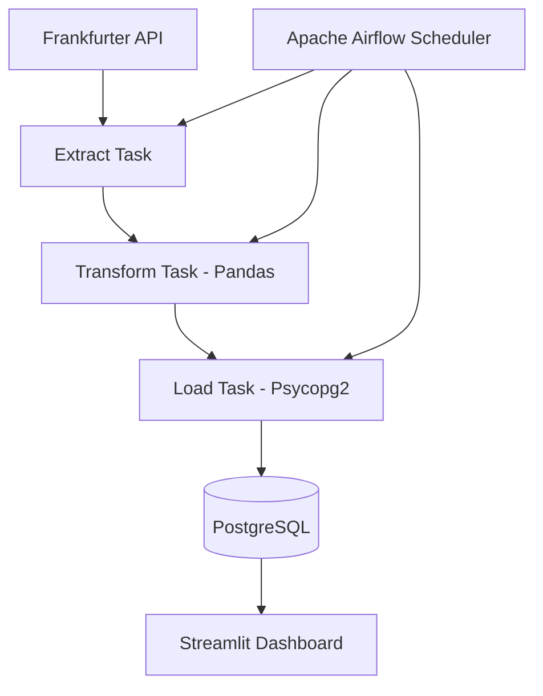

# 💱 Automated Currency Exchange ETL Pipeline & Dashboard

An end-to-end data engineering project that automates the ingestion, transformation, storage, and visualization of foreign exchange rate data.

The pipeline extracts daily exchange rates from the Frankfurter API, processes the data using Pandas, stores it in PostgreSQL, orchestrates workflows with Apache Airflow, and exposes insights through an interactive Streamlit dashboard.

---

## 📌 Project Highlights

* Automated ETL workflow orchestrated with Apache Airflow
* Containerized infrastructure using Docker and Docker Compose
* PostgreSQL-based persistent storage for historical exchange rates
* Data transformation and validation using Pandas
* Interactive Streamlit dashboard for real-time analysis
* Modular architecture designed for scalability and maintainability

---

## 🏗️ Architecture



---

## 🔄 Pipeline Workflow

### 1. Extract

Daily exchange rate data is retrieved from the Frankfurter API with appropriate timeout configurations and error handling mechanisms.

### 2. Transform

Raw JSON responses are processed using Pandas. The transformation stage includes:

* Parsing and structuring the incoming data
* Validating data types
* Removing unnecessary metadata
* Converting exchange rates into appropriate numerical formats

### 3. Load

Processed records are inserted into PostgreSQL using `psycopg2`.

The loading process ensures:

* Reliable persistence of historical data
* Prevention of duplicate entries
* Preservation of data integrity

### 4. Orchestration

Apache Airflow coordinates the entire ETL process as a Directed Acyclic Graph (DAG), enabling:

* Task scheduling
* Dependency management
* Execution monitoring
* Inter-task communication through XComs

### 5. Visualization

A Streamlit application provides an intuitive interface for exploring exchange rate trends through interactive charts and filters powered by live PostgreSQL queries.

---

## 🛠️ Tech Stack

| Category                | Technologies           |
| ----------------------- | ---------------------- |
| Language                | Python 3.11+           |
| Data Processing         | Pandas                 |
| Workflow Orchestration  | Apache Airflow 2.x     |
| Database                | PostgreSQL 15          |
| Database Administration | pgAdmin4               |
| Containerization        | Docker, Docker Compose |
| Dashboard               | Streamlit              |
| Database Connectivity   | psycopg2               |

---

## 🚀 Getting Started

### Prerequisites

Ensure the following tools are installed:

* Docker
* Docker Compose
* Python 3.11+

---

### 1. Clone the Repository

```bash
git clone https://github.com/kursadyavuzlu/Automated-Currency-Exchange-ETL-Pipeline-Dashboard.git

cd Automated-Currency-Exchange-ETL-Pipeline-Dashboard
```

---

### 2. Start the Infrastructure

Build and launch the Airflow and PostgreSQL services:

```bash
docker compose up -d
```

---

### 3. Access Airflow

Open the Airflow interface:

```
http://localhost:8080
```

From the UI, enable or manually trigger the `currency_etl_pipeline` DAG.

---

### 4. Access pgAdmin

Inspect the PostgreSQL database through pgAdmin:

```
http://localhost:5050
```

Locate the `exchange_rates` table inside the PostgreSQL instance.

---

### 5. Launch the Dashboard

Install the required dependencies:

```bash
pip install streamlit pandas psycopg2-binary
```

Start the Streamlit application:

```bash
streamlit run dashboard.py
```

The dashboard will be available at:

```
http://localhost:8501
```

---

## 📊 Dashboard Preview

Add screenshots or GIF demonstrations of the Streamlit interface here.

Example:

```
docs/dashboard-preview.png
```

---

## 📈 Future Improvements

* Integrate Slack or email notifications for Airflow task failures
* Introduce dbt for data modeling and testing workflows
* Implement automated data quality checks
* Deploy the pipeline to cloud environments such as AWS
* Replace local PostgreSQL with cloud-native data warehouses (Snowflake, Redshift)

---

## 📄 License

This project is intended for educational and portfolio purposes.
